# 나만의 퀴즈 게임 🎯

터미널에서 동작하는 파이썬 콘솔 퀴즈 게임입니다.
Python 기본 문법과 클래스(객체 지향)로 구조를 나누고, JSON 파일로 데이터를 저장해
프로그램을 종료했다가 다시 실행해도 퀴즈와 점수가 유지되도록 만들었습니다.

- 제출 저장소: https://github.com/02junho/codyssey-Mission2

## 1. 프로젝트 개요

메뉴에서 번호를 골라 퀴즈를 풀고, 추가하고, 목록을 보고, 점수를 확인할 수 있는 프로그램입니다.
데이터는 프로젝트 루트의 `state.json`에 저장되어 프로그램을 껐다 켜도 이어집니다.

## 2. 퀴즈 주제와 선정 이유

주제는 **파이썬 / 프로그래밍 기초**입니다.
이번 미션에서 직접 배우고 사용한 개념(자료형, 리스트, 주석, 내장 함수 등)을 문제로 만들면,
게임을 만드는 것 자체가 복습이 되고, 문제 하나하나의 정답 근거를 스스로 설명할 수 있기 때문입니다.
기본 퀴즈 7문제를 파이썬 주제로 직접 작성했습니다.

## 3. 실행 방법

Python 3.10 이상이 필요하며, 외부 라이브러리 없이 표준 라이브러리만 사용합니다.
저장소를 내려받은 뒤 프로젝트 폴더에서 아래 명령을 실행합니다.

```bash
git clone https://github.com/02junho/codyssey-Mission2.git
cd codyssey-Mission2
python3 main.py
```

> macOS/Linux는 `python3`, Windows는 `python`으로 실행합니다.

실행하면 메뉴가 나타나고, 번호를 입력해 기능을 사용할 수 있습니다.

```text
========================================
           🎯 나만의 퀴즈 게임 🎯
========================================
  1. 퀴즈 풀기
  2. 퀴즈 추가
  3. 퀴즈 목록
  4. 점수 확인
  5. 퀴즈 삭제
  6. 종료
========================================
선택:
```

## 4. 기능 목록

- **퀴즈 풀기**: 저장된 퀴즈를 출제하고 정답/오답을 채점, 결과와 점수를 보여줍니다.
  - (보너스) 문제 순서 랜덤 출제, 풀 문제 수 선택, 힌트 보기(사용 시 점수 절반)
- **퀴즈 추가**: 문제·선택지 4개·정답 번호를 입력받아 등록하고 파일에 저장합니다.
- **퀴즈 목록**: 등록된 모든 퀴즈를 번호와 함께 보여줍니다.
- **점수 확인**: 최고 점수와 (보너스) 최근 게임 기록을 보여줍니다.
- **퀴즈 삭제** (보너스): 번호를 골라 퀴즈를 삭제하고 파일에 반영합니다.
- **예외 처리**: 잘못된 입력(문자·범위 밖·빈 입력)은 안내 후 다시 입력받고,
  `Ctrl+C`/입력 종료 시에도 저장 후 안전하게 종료합니다.
  데이터 파일이 없거나 손상돼도 기본 퀴즈로 실행됩니다.

## 5. 파일 구조

```text
codyssey-Mission2/
├── main.py          # 프로그램 진입점 (python3 main.py 로 실행)
├── quiz.py          # Quiz 클래스 (퀴즈 한 문제)
├── quiz_game.py     # QuizGame 클래스 (게임 전체) + 입력 도우미 함수
├── state.json       # 데이터 저장 파일 (실행 시 자동 생성, .gitignore 처리)
├── .gitignore
├── README.md
└── docs/
    └── screenshots/         # 실행 화면과 Git 기록 캡처
        ├── menu.png
        ├── play1.png
        ├── play2.png
        ├── add_quiz.png
        ├── quiz_list.png
        ├── score.png
        ├── invalid_input.png
        ├── restart.png
        ├── broken_state.png
        ├── dev_env.png
        ├── git_pull.png
        └── git_log.png
```

### 5-1. 클래스와 메서드 구성

역할이 다른 두 가지를 각각 클래스로 나눴습니다.
`Quiz`는 **문제 한 개**를, `QuizGame`은 **게임 전체**를 담당합니다.

| 클래스 | 파일 | 담당 | 주요 메서드 |
|---|---|---|---|
| `Quiz` | `quiz.py` | 퀴즈 한 문제 | `show()` 문제 출력, `is_correct()` 정답 확인, `to_dict()`/`from_dict()` JSON 변환 |
| `QuizGame` | `quiz_game.py` | 게임 전체 | `show_menu()`, `play_quiz()`, `add_quiz()`, `list_quizzes()`, `show_score()`, `delete_quiz()`, `load_state()`/`save_state()`, `run()` |

입력 처리는 클래스 밖의 도우미 함수로 분리해 여러 기능에서 재사용합니다.

| 함수 | 역할 |
|---|---|
| `read_int(prompt, min, max)` | 범위 안의 정수를 받을 때까지 반복 (공백 제거, 문자·범위 밖·빈 입력 처리) |
| `read_text(prompt)` | 비어 있지 않은 문자열을 받을 때까지 반복 |

- `to_dict()`/`from_dict()`가 필요한 이유: JSON은 `Quiz` 객체를 그대로 저장할 수 없으므로,
  저장할 때는 딕셔너리로 바꾸고 불러올 때는 다시 객체로 되돌립니다.

## 6. 데이터 파일 설명 (`state.json`)

- **경로**: 프로젝트 루트 `state.json` (실행하는 위치와 무관하게 소스 파일이 있는 폴더 기준)
- **인코딩**: UTF-8 (`ensure_ascii=False` 로 한글이 그대로 저장됨)
- **역할**: 등록된 퀴즈 목록, 최고 점수, 게임 기록을 저장해 프로그램 재실행 후에도 유지
- **없을 때**: 기본 퀴즈 7문제로 시작 / **손상됐을 때**: 안내 후 기본 퀴즈로 복구

스키마 예시:

```json
{
  "quizzes": [
    {
      "question": "Python에서 리스트를 만들 때 사용하는 괄호는?",
      "choices": ["( )", "[ ]", "{ }", "< >"],
      "answer": 2,
      "hint": "대괄호입니다."
    }
  ],
  "best_score": 80,
  "best_detail": { "correct": 4, "total": 5 },
  "history": [
    { "datetime": "2026-07-30 19:40:00", "total": 5, "correct": 4, "score": 80 }
  ]
}
```

- `quizzes`: 퀴즈 목록 (문제/선택지/정답/힌트)
- `best_score`: 최고 점수(0~100)
- `best_detail`: 최고 점수를 낸 게임의 정답 수/전체 문제 수
- `history`: 게임 기록 (날짜, 문제 수, 정답 수, 점수)

## 7. 실행 화면

### 7-1. 메뉴

프로그램을 처음 실행하면 저장된 데이터가 없으므로 기본 퀴즈로 시작합니다.

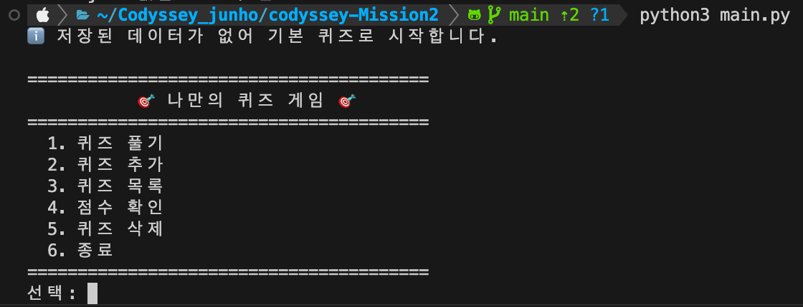

### 7-2. 퀴즈 풀기

풀 문제 수를 고르면 무작위로 출제됩니다. `0`을 입력하면 힌트를 볼 수 있고, 힌트를 사용한 문제는 절반 점수만 인정됩니다.

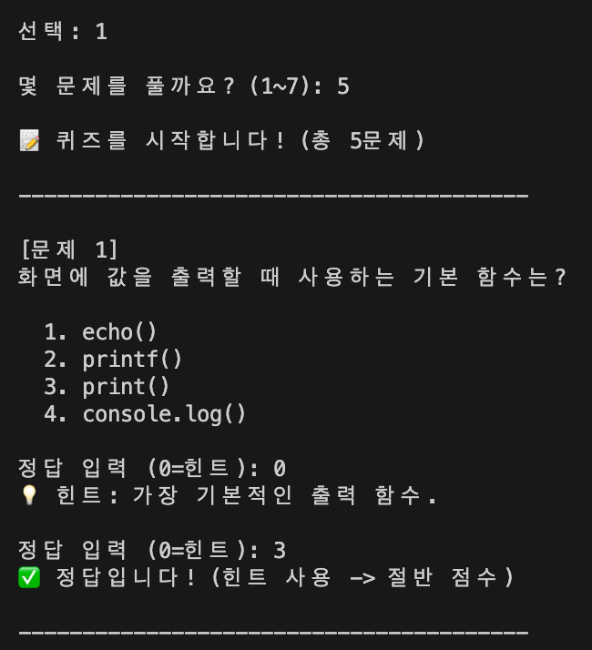

모든 문제를 풀면 결과와 점수가 나오고, 최고 점수를 넘으면 갱신됩니다.
아래 화면은 5문제 중 5문제를 맞혔지만 한 문제에서 힌트를 사용해 90점이 된 결과입니다.

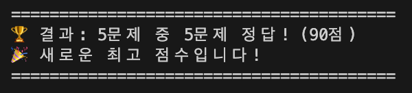

### 7-3. 퀴즈 추가

문제, 선택지 4개, 정답 번호, 힌트를 입력받아 등록하고 `state.json`에 저장합니다.

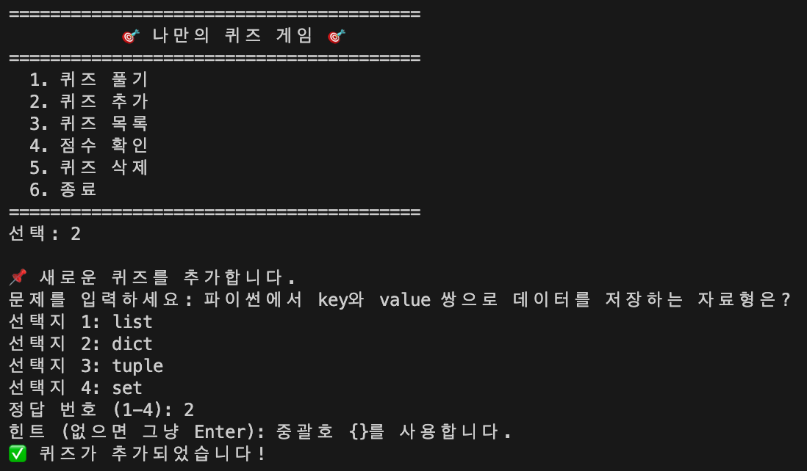

### 7-4. 퀴즈 목록

기본 퀴즈 7개에 추가한 1개가 더해져 총 8개가 표시됩니다.

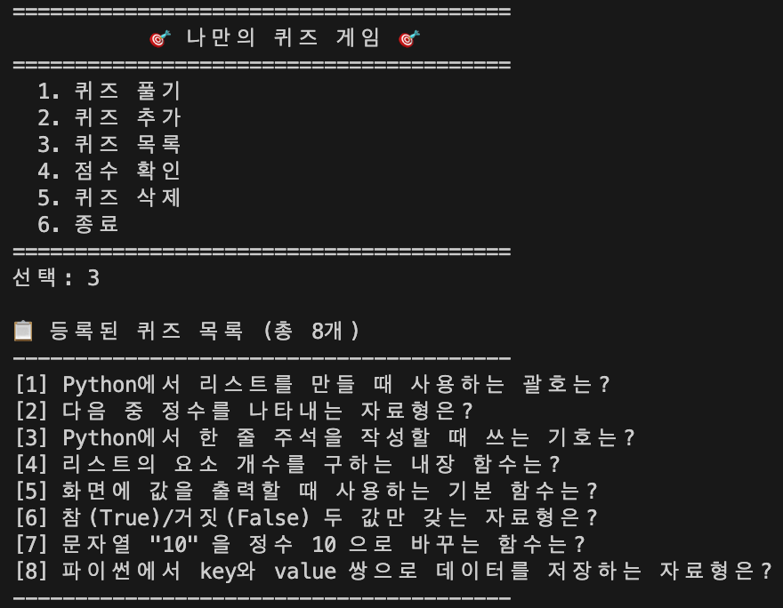

### 7-5. 점수 확인

최고 점수와 최근 게임 기록을 함께 보여줍니다.

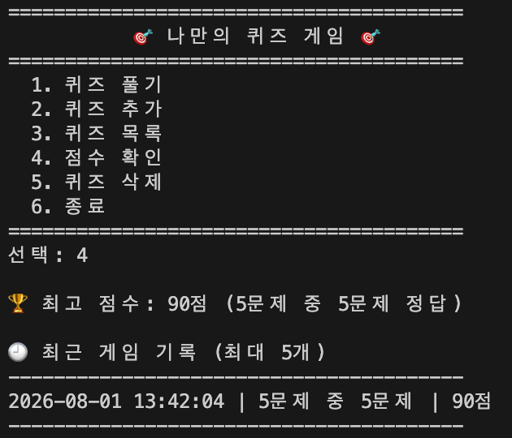

### 7-6. 잘못된 입력 처리

숫자가 아닌 입력, 허용 범위 밖 숫자, 빈 입력을 모두 안내 후 재입력 흐름으로 되돌립니다.

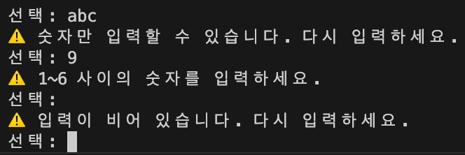

### 7-7. 재실행 후 데이터 유지

프로그램을 종료한 뒤 다시 실행해도 추가한 퀴즈와 최고 점수가 그대로 유지됩니다.

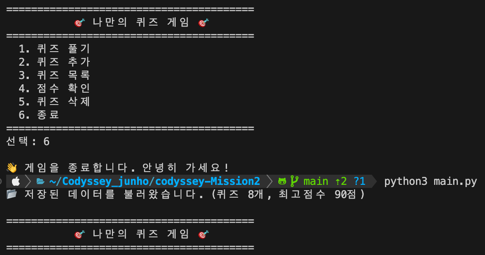

### 7-8. 데이터 파일 손상 시 복구

`state.json`이 손상된 경우에도 프로그램이 종료되지 않고, 안내 메시지를 출력한 뒤 기본 퀴즈로 복구합니다.

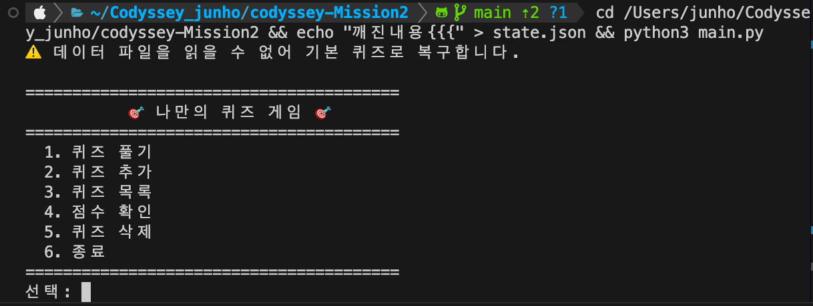

## 8. 개발 환경

```bash
$ python3 --version
Python 3.10.14

$ git --version
git version 2.50.1 (Apple Git-155)

$ git config --list | grep -E 'user\.name|init\.'
init.defaultbranch=main
user.name=02junho
```

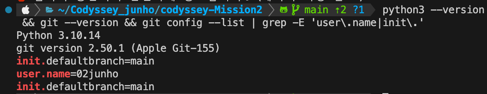

- Python 3.10 이상에서 동작합니다. (검증 환경: Python 3.10.14)
- 외부 라이브러리를 설치하지 않고 표준 라이브러리만 사용합니다.
  - `json`: 데이터를 JSON 형식으로 저장하고 불러오기
  - `os`: `state.json` 경로 계산과 파일 존재 여부 확인
  - `random`: 퀴즈 순서 무작위 출제
  - `datetime`: 게임 기록의 날짜/시간 기록

## 9. Git 작업 기록

기능 단위로 커밋하고, 퀴즈 풀기 기능은 별도 브랜치에서 작업한 뒤 `main`에 병합했습니다.

### 9-1. 커밋 이력과 브랜치 병합

```bash
$ git log --oneline --graph --all
```

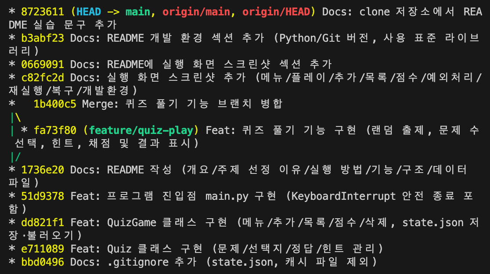

- 총 12개의 커밋을 기능 단위로 남겼습니다.
- 커밋 메시지는 `Feat:`(기능 추가), `Docs:`(문서), `Merge:`(병합) 형식으로 변경 내용을 요약했습니다.
- `feature/quiz-play` 브랜치에서 퀴즈 풀기 기능을 구현한 뒤 `main`으로 병합했습니다.
  `--no-ff` 옵션을 사용해 병합 기록이 그래프에 남도록 했습니다.

```bash
$ git checkout -b feature/quiz-play      # 브랜치 생성 및 이동
$ git commit -m "Feat: 퀴즈 풀기 기능 구현 ..."
$ git checkout main                      # main 으로 이동
$ git merge --no-ff feature/quiz-play -m "Merge: 퀴즈 풀기 기능 브랜치 병합"
```

**브랜치를 나눈 이유**: `main`은 언제나 동작하는 상태로 두고, 새 기능은 분리된 공간에서 만들다가
완성되면 합치기 위해서입니다. 여러 명이 작업할 때 서로의 코드에 영향을 주지 않는 것이 핵심입니다.

### 9-2. clone 과 pull 실습

원격 저장소를 별도 디렉터리로 복제해 수정·푸시한 뒤, 원본 작업 디렉터리에서 `pull`로 가져왔습니다.

```bash
# 1) 별도 디렉터리로 복제
$ git clone git@github.com:02junho/codyssey-Mission2.git codyssey-Mission2-clone

# 2) 복제본에서 README 를 수정하고 푸시
$ cd codyssey-Mission2-clone
$ git commit -m "Docs: clone 저장소에서 README 실습 문구 추가"
$ git push

# 3) 원본 작업 디렉터리에서 변경사항 가져오기
$ cd ../codyssey-Mission2
$ git pull
```

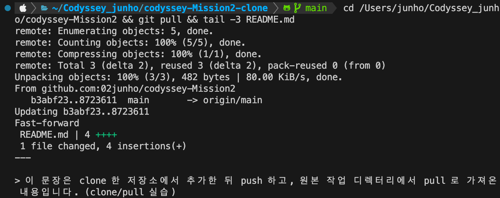

`Fast-forward`로 병합되면서 README에 추가한 문장이 원본 디렉터리에도 반영된 것을 확인했습니다.
아래 문장이 그때 가져온 내용입니다.

> 이 문장은 clone 한 저장소에서 추가한 뒤 push 하고, 원본 작업 디렉터리에서 pull 로 가져온 내용입니다. (clone/pull 실습)

### 9-3. 사용한 Git 명령어

| 명령어 | 사용한 곳 |
|---|---|
| `init` | 로컬 저장소 생성 |
| `add` | 변경 파일을 스테이징에 올림 |
| `commit` | 기능 단위로 이력 저장 (12회) |
| `push` | GitHub 원격 저장소로 업로드 |
| `pull` | 복제본에서 푸시한 변경사항 가져오기 |
| `checkout` | `feature/quiz-play` 브랜치 생성 및 이동 |
| `clone` | 원격 저장소를 별도 디렉터리로 복제 |
